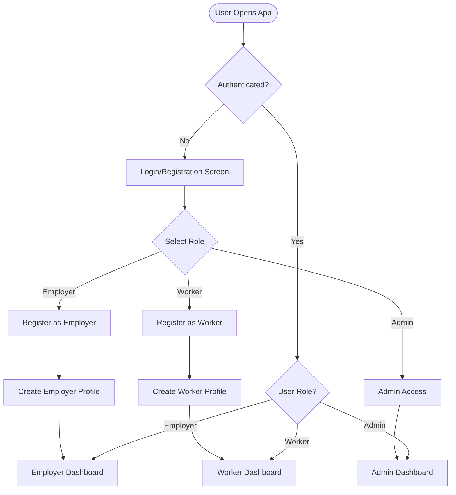
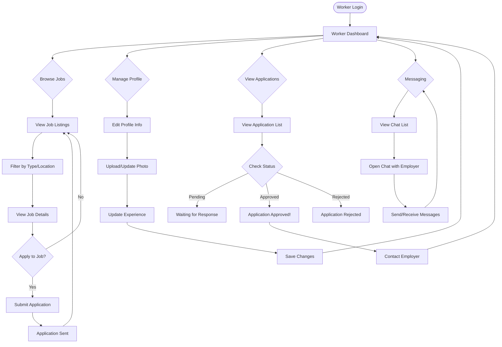
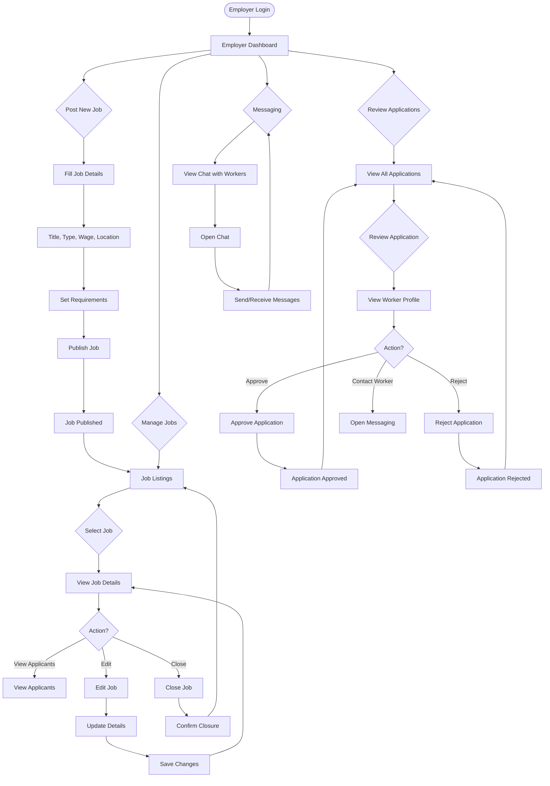
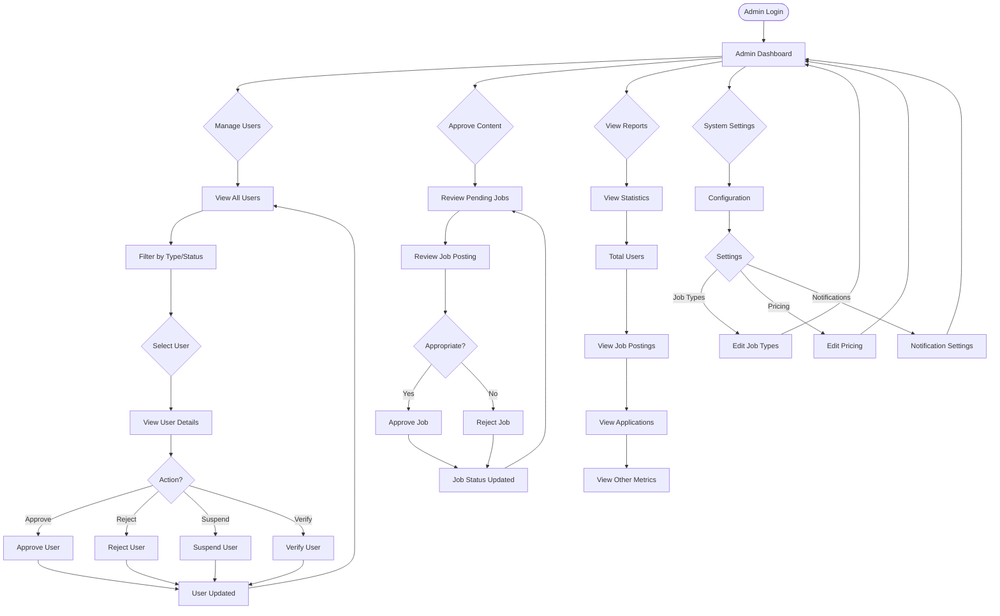
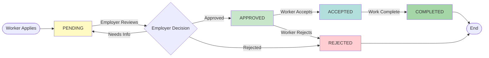
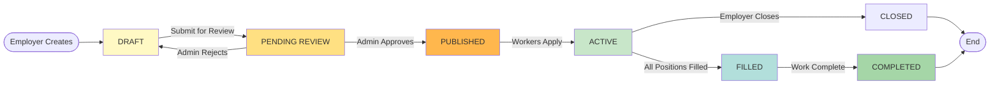
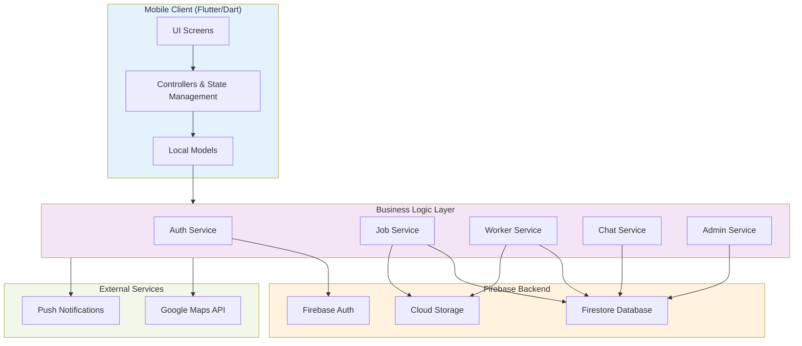

# KormoBD - Full Application Flow Chart

## 1. Authentication Flow

## 2. Complete User Journey - Worker Flow

## 3. Complete User Journey - Employer Flow

## 4. Complete User Journey - Admin Flow

## 5. Application Status Lifecycle

## 6. Job Status Lifecycle

## 7. Data Flow Architecture

## 8. Key Features Summary

| Feature | Worker | Employer | Admin |
|---------|--------|----------|-------|
| Browse & Filter Jobs | ✓ | - | - |
| Apply to Jobs | ✓ | - | - |
| Track Applications | ✓ | - | - |
| Manage Profile | ✓ | - | - |
| Post New Jobs | - | ✓ | - |
| Manage Job Postings | - | ✓ | - |
| Review Applications | - | ✓ | - |
| Accept/Reject Applicants | - | ✓ | - |
| Real-time Chat | ✓ | ✓ | - |
| View All Users | - | - | ✓ |
| Approve/Reject Users | - | - | ✓ |
| Approve Job Postings | - | - | ✓ |
| View Analytics | - | - | ✓ |
| System Settings | - | - | ✓ |
