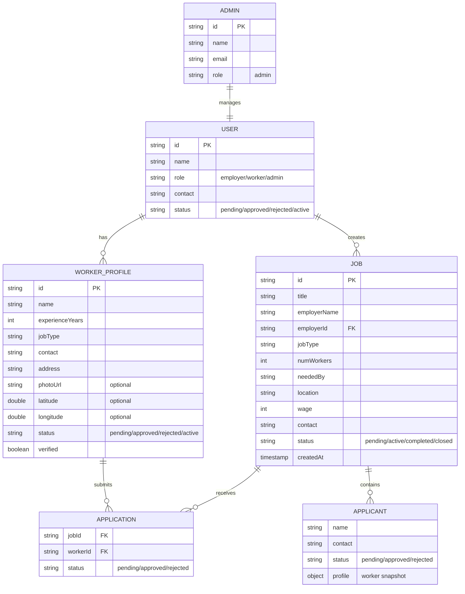

# KormoBD - Entity Relationship Diagram

## Entity Details

### User
- **Primary Key**: id
- **Attributes**: name, role, contact, status
- **Roles**: employer, worker, admin
- **Relationships**: has WorkerProfile, creates Job

### WorkerProfile
- **Primary Key**: id
- **Foreign Key**: Links to User
- **Attributes**: experienceYears, jobType, address, location (lat/lng), photoUrl, verified status
- **Relationships**: submits Application

### Job
- **Primary Key**: id
- **Foreign Key**: employerId (references User)
- **Attributes**: title, jobType, wage, numWorkers, neededBy, location, status
- **Relationships**: receives Applications, contains Applicants

### Application
- **Composite Key**: jobId + workerId
- **Foreign Keys**: jobId (Job), workerId (WorkerProfile)
- **Attributes**: status (pending/approved/rejected)
- **Purpose**: Junction table linking workers to jobs

### Applicant
- **Embedded in**: Job document
- **Attributes**: name, contact, status, worker profile snapshot
- **Purpose**: Denormalized snapshot of worker info for quick access

### Admin
- **Primary Key**: id
- **Attributes**: name, email, role
- **Purpose**: System administrator for approval workflows
